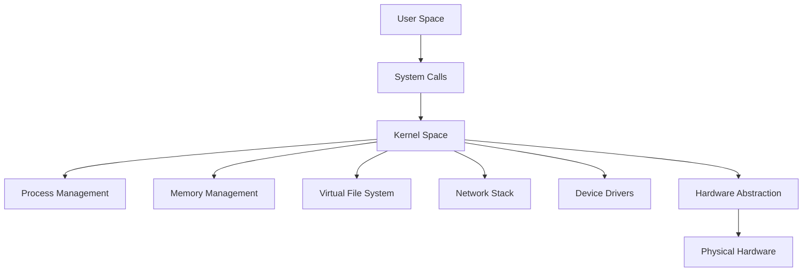

# Understanding Kernels: The Core of Operating Systems

## What is a Kernel?

The **kernel** is the fundamental core component of an operating system. It acts as a bridge between software applications and the physical hardware of a computer.

Think of it as the **central nervous system** of your OS that:

- Manages hardware resources (CPU, memory, devices)
- Handles communication between software and hardware
- Provides essential services for applications to run
- Enforces security and access controls

---

## Types of Kernels

### 1. Monolithic Kernel

- **Description:** All OS services run in kernel space in a single large process
- **Characteristics:**
  - Fast performance due to direct communication
  - Complex development and debugging
  - Entire OS must be recompiled for changes
- **Examples:** Linux, Unix, BSD, Windows (NT kernel is hybrid but leans monolithic)

### 2. Microkernel

- **Description:** Minimal core with only essential services in kernel space
- **Characteristics:**
  - Smaller and more secure
  - Services run as user-level processes
  - Slower performance due to message passing
  - Easier to maintain and extend
- **Examples:** MINIX, QNX, L4, GNU Hurd

### 3. Hybrid Kernel

- **Description:** Combines monolithic and microkernel approaches
- **Characteristics:**
  - Performance of monolithic with modularity of microkernel
  - Some services run in kernel space, others in user space
  - Balances speed and security
- **Examples:** Windows NT, XNU (macOS/iOS), BeOS

### 4. Exokernel

- **Description:** Minimalist approach that separates protection from management
- **Characteristics:**
  - Applications can directly access hardware resources
  - Library OS provides abstractions
  - Maximum flexibility and performance
  - Complex to develop
- **Examples:** MIT Exokernel, Nemesis

---

## What Makes the Linux Kernel Special?

1. Monolithic Design with Modular Capabilities

2. Unparalleled Hardware Support

  3. Open Source Development Model

4. Unmatched Scalability

5. Advanced Security Features

6. Performance Innovations

7. Real-Time Capabilities

8. Containerization Revolution

9. Stability and Longevity

---

## Linux Kernel Architecture

## Fun Facts About the Linux Kernel

* First version (0.01) released in 1991 by Linus Torvalds
* Grew from 10,000 lines of code to over 28 million lines
* Powers 90% of cloud infrastructure and all top 500 supercomputers
* Runs on the International Space Station laptops
* Android's kernel is a modified Linux kernel
* Has its own mascot: **Tux the Penguin**
* Development follows a "release early, release often" philosophy
