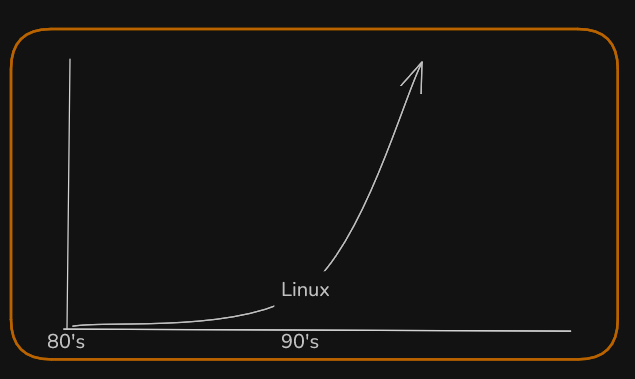
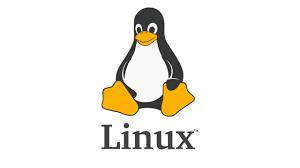

# Open Source Tools

## what is Software?

In a computer system, the software is basically a set of instructions that tell a computer to do a specific task that serves its users.

* A software is not a physical thing like hardware, it rather makes the hardware work as per user requirements by giving instructions.

## **what are open source tools?**

Open source tools are software with publicly available source code which can be use for free of cost, That is a thing but the point of open source softwars or tools are all about **freedom.**

By this, I mean the freedom for user and developers do much more with open source software.
In this softwares you can able to create feachers, report the bugs and also fix them.
which make you as contrebuter of that software.



Previously most of the large software projects happend in side the private companies.
they sell thir proprietary software, typically with after sales support, Interest in open source started in early 80s.
But, the Exponential growth happened after Linux.



That is the point where two approaches, mixing proprietary software with open source.
Red Hat is one the best known example with Red Hat Enterprise Linux, or RHEL.
But RHEL has open source counterpart called centerOS.


### **Are Open-Source Tools Secure?**

Yes, open-source tools can be secure. While the source code is publicly available, this does not mean it is insecure. In fact, open-source software often benefits from having a large and active community of developers and users.

Because many eyes are reviewing the code, vulnerabilities can be identified and resolved quickly. When bugs or security issues are reported, contributors from around the world often collaborate to fix them faster than in closed-source software, where only a limited number of developers have access to the code.

However, like any software, open-source tools must be used responsibly:

Always use well-maintained and trusted projects.

* Keep dependencies updated.
* Watch for security advisories.

### **Example**

* **GIMP** : A powerful cross-platform imageeditor favored by photographers and graphic designers.
* **VLC Media Player** : A popular multimediplayer supporting nearly all audio and video formats with hardware
* **Shotcut** : Advanced open-source video editing software used for non-destructive editing and wide format support
* **Linux** : The most in-demand open-source operating system known for its security, flexibility, and community support, running desktops and many devices.
* **Git** : The world's most popular distributed version control system, critical for software development and open-source collaboration.
* **Apache Hadoop and Apache Spark** : Leading open-source big data platforms for distributed data processing and analytics, widely used in enterprise data environments **.**
* **Jupyter Notebook** : An interactive computing environment popular in data science and education for combining code, visualizations, and text.
* **Docker and Kubernetes** : Dominant open-source tools for containerization and orchestration to build scalable cloud-native applications.
* **Grafana and Prometheus** : Widely used for monitoring, alerting, and data visualization in IT and IoT systems.

# Linux & Web Servers Guide for Beginners

<<<<<<< HEAD
## Table of Contents
=======
| #  | **Action**            | **Windows CMD Command**   | **Linux Bash Equivalent**   |
| -- | --------------------------- | ------------------------------- | --------------------------------- |
| 1  | Change directory            | `cd <directory>`              | `cd <directory>`                |
| 2  | List directory contents     | `dir`                         | `ls`                            |
| 3  | Create a directory          | `mkdir <directory>`           | `mkdir <directory>`             |
| 4  | Remove a directory          | `rmdir <directory>`           | `rmdir <directory>` or rm -r    |
| 5  | Delete a file               | `del <filename>`              | `rm <filename>`                 |
| 6  | Copy a file                 | `copy <source> <destination>` | `cp <source> <destination>`     |
| 7  | Move a file                 | `move <source> <destination>` | `mv <source> <destination>`     |
| 8  | Rename a file               | `rename <oldname> <newname>`  | `mv <oldname> <newname>`        |
| 9  | Display a message           | `echo <message>`              | `echo <message>`                |
| 10 | Ping a host                 | `ping <hostname>`             | `ping <hostname>`               |
| 11 | Clear screen                | `cls`                         | `clear`                         |
| 12 | Display IP configuration    | `ipconfig`                    | `ifconfig` or `ip a`          |
| 13 | List running tasks          | `tasklist`                    | `ps aux` or `top`             |
| 14 | Kill a running process      | `taskkill /IM <process-name>` | `killall <process-name>`        |
| 15 | Disk check                  | `chkdsk <drive>:`             | `fsck` (run on unmounted disks) |
>>>>>>> 78aa7457116a524c491be4fe4d4c65a534cdfa8b

1. [Linux Command Line – File Operations, Navigation, Permissions](#1-linux-command-line)
2. [Vim &amp; Emacs Editors](#2-vim--emacs-editors)
3. [Package Management](#3-package-management)
4. [Shell Scripting](#4-shell-scripting)
5. [Web Servers](#5-web-servers)

## 1. Linux Command Line

*The command line is a text-based way to control your computer. Think of it like typing instructions instead of clicking icons. **Bash** is the most common "language" for these instructions.*

### Navigation (Moving Around)

- **`pwd`** (Print Working Directory): Shows where you are

  ```bash
  pwd
  # Output: /home/user
  ```
- **`cd`** (Change Directory): Move to a different folder

  ```bash
  cd Documents  # Go into the "Documents" folder
  cd ..         # Go back one level
  cd ~          # Go to your home folder
  ```
- **`ls`** (List): Shows files/folders in your current location

  ```bash
  ls            # Basic list
  ls -l         # Detailed list (permissions, size, date)
  ls -a         # Show hidden files (starting with ".")
  ```

### File Operations

- **`touch`** (Create empty file):
  ```bash
  touch notes.txt  # Creates "notes.txt"
  ```
- **`cp`** (Copy):
  ```bash
  cp notes.txt backup/  # Copy "notes.txt" into the "backup" folder
  ```
- **`mv`** (Move/Rename):
  ```bash
  mv notes.txt old_notes.txt  # Renames the file
  mv notes.txt Documents/     # Moves file to "Documents"
  ```
- **`rm`** (Remove/Delete):
  ```bash
  rm old_notes.txt  # Deletes the file (BE CAREFUL - no undo!)
  ```
- **`mkdir`** (Make Directory):
  ```bash
  mkdir projects   # Creates a new folder named "projects"
  ```

### Permissions

Every file has 3 permission types: **Read (r)**, **Write (w)**, **Execute (x)**, for 3 user types: **Owner**, **Group**, **Others**.

- **`chmod`** (Change Permissions):
  ```bash
  chmod +x script.sh  # Makes "script.sh" executable (like a program)
  chmod 755 file.txt  # Owner: rwx, Group: r-x, Others: r-x
  ```
- **`chown`** (Change Owner):
  ```bash
  chown user:group file.txt  # Changes owner and group
  ```
- View permissions with `ls -l`:
  ```bash
  ls -l
  # Output: -rw-r--r-- 1 user group 123 Jan 1 12:00 file.txt
  # Permissions: - (file), rw- (owner), r-- (group), r-- (others)
  ```

> **Why It Matters**: Like learning to drive a car, the command line gives you full control over your computer.
> It's faster for repetitive tasks and essential for managing servers or automating work.

---

## 2. Vim & Emacs Editors

**Vim** and **Emacs** are powerful text editors for the command line. They're like supercharged versions of Notepad, but they require learning keyboard shortcuts instead of using a mouse.

### Vim Basics

- **Modes**:
  - **Normal Mode**: Navigation (press `Esc` to enter)
  - **Insert Mode**: Typing text (press `i` to enter)
- **Key Shortcuts**:
  - `i` → Insert text
  - `Esc` → Exit to Normal Mode
  - `:w` → Save
  - `:q` → Quit
  - `:wq` → Save and quit
  - `dd` → Delete a line
  - `/word` → Search for "word"
- **Configuration**:
  Edit `~/.vimrc` to customize settings (e.g., `set number` shows line numbers)

### Emacs Basics

- **Key Shortcuts**:
  - `Ctrl+x Ctrl+f` → Open file
  - `Ctrl+x Ctrl+s` → Save
  - `Ctrl+x Ctrl+c` → Quit
  - `Ctrl+s` → Search
- **Configuration**:
  Edit `~/.emacs` or `~/.emacs.d/init.el` to add settings (e.g., `(setq line-number-mode t)` shows line numbers)

### Example Workflow (Vim)

1. Open a file: `vim notes.txt`
2. Press `i` to type text
3. Press `Esc` to return to Normal Mode
4. Type `:wq` to save and quit

> **Why It Matters**: These editors are lightweight and work anywhere (even on servers). Mastering them makes editing code or configuration files lightning-fast.

---

## 3. Package Management

**Package managers** are like app stores for Linux. They handle installing, updating, and removing software automatically.

### apt (Debian/Ubuntu systems)

- Update software list:
  ```bash
  sudo apt update
  ```
- Install software:
  ```bash
  sudo apt install firefox  # Installs Firefox browser
  ```
- Remove software:
  ```bash
  sudo apt remove firefox
  ```
- Upgrade all installed software:
  ```bash
  sudo apt upgrade
  ```

### yum (Red Hat/CentOS systems)

- Install software:
  ```bash
  sudo yum install python3
  ```
- Remove software:
  ```bash
  sudo yum remove python3
  ```
- Update all software:
  ```bash
  sudo yum update
  ```

> **Why It Matters**: Package managers ensure software is installed correctly with all required dependencies (like puzzle pieces). They also handle security updates automatically.

---

## 4. Shell Scripting

**Shell scripting** is writing sequences of commands in a file to automate tasks. It's like creating a recipe for your computer to follow.

### Basic Script Structure

```bash
#!/bin/bash  # Tells Linux to use Bash
echo "Hello, World!"  # Prints text
```

Save as `hello.sh`, then run:

```bash
bash hello.sh
```

### Variables & Input

```bash
#!/bin/bash
echo "What's your name?"
read name  # Reads user input
echo "Hello, $name!"
```

### Conditions (If/Else)

```bash
#!/bin/bash
if [ "$name" == "Maheedhar" ]; then
  echo "Welcome, Maheedhar!"
else
  echo "You're not Maheedhar!"
fi
```

### Loops

```bash
#!/bin/bash
for i in 1 2 3 4 5; do
  echo "Count: $i"
done
```

> **Why It Matters**: Scripts save time! Instead of typing the same commands daily, automate backups, file organization, or system checks.

---

## 5. Web Servers

**Web servers** are software that delivers websites to browsers. **Apache** and **Nginx** are the most popular. **SSL** encrypts data (HTTPS), and **virtual hosts** let you host multiple websites on one server.

### Install Apache (Ubuntu)

```bash
sudo apt install apache2
```

Start the server:

```bash
sudo systemctl start apache2
```

Visit `http://localhost` in a browser to see the default page.

### Install Nginx (Ubuntu)

```bash
sudo apt install nginx
```

### SSL (HTTPS) with Let's Encrypt

```bash
sudo apt install certbot python3-certbot-apache
sudo certbot --apache -d yourdomain.com
```

This automatically installs a free SSL certificate.

### Virtual Hosts (Host Multiple Sites)

1. Create a config file:
   ```bash
   sudo nano /etc/apache2/sites-available/mysite.conf
   ```
2. Add configuration:
   ```apache
   <VirtualHost *:80>
       ServerName mysite.com
       DocumentRoot /var/www/mysite
   </VirtualHost>
   ```
3. Enable the site:
   ```bash
   sudo a2ensite mysite.conf
   sudo systemctl reload apache2
   ```

> **Why It Matters**: Web servers power the internet! Knowing how to configure them lets you host websites, secure data with SSL, and manage multiple sites efficiently.
